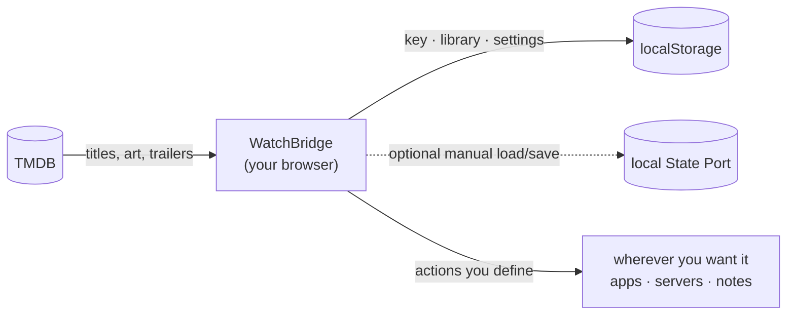

<div align="center">


# WatchBridge

**Decide what to watch - then actually do something about it.**

[**Open the app →**](https://tahsinature.github.io/watch-bridge/)

</div>

---

## What it is

Choosing something to watch usually means a dozen open tabs: one to look the
title up, one to read about it, one to see where it's streaming, one to find a
copy, one to note that you finished it. WatchBridge collapses that into a single
screen — and then lets you define, yourself, where a title goes next.

It's a static web app. By default there is no server, account, or database: it
runs entirely in your browser and keeps everything there. Local development can
optionally connect to the bundled State Port MVP for explicit cross-browser backup.

## How it works



**Search.** One box looks up films and series together, and ranks what comes
back so the things people have actually seen rise to the top rather than
whatever happens to match the text best.

**Triage.** Line up the candidates you're considering, put them side by side,
and pick one. When you've watched it, rate it and write down what you thought.

**Act.** This is the bridge. Every button attached to a title is one you
configure: give it a URL template, a clipboard string, an app link or an HTTP
request, and it gets filled in from whichever title is on screen. Send a film to
a tracker, push a download to a home server, open it in a native app, drop a
note into your log — whatever your setup happens to be. The app doesn't assume
one.

## Bring your own key

WatchBridge talks to [TMDB](https://www.themoviedb.org) for everything it
knows about a title, and you supply the key — free, takes a minute. It's stored
in your browser. If you explicitly save through local State Port, it is included
in the whole-document backup; State Port does not encrypt it.

That also means a link you share opens the _app_, not your data. There's nothing
to leak, and nothing to sign into.

## Running it locally

```bash
bun install
bun run dev
```

Then open **Settings** and paste your TMDB key.

```bash
bun run build      # typecheck + production build
bun run preview    # serve the build
```

Pushing to `master` deploys to GitHub Pages via the included workflow. Set
**Settings → Pages → Source** to **GitHub Actions** first.

Before merging a release, bump the patch version and commit the updated
`package.json`:

```bash
bun run version:patch
```

The current version is shown at the bottom of the app's Settings dialog.

## Testing local State Port integration

This is a local-development integration only. Start State Port first:

```bash
cd config-sync-service
docker compose up --build -d
```

Open [http://localhost:8080](http://localhost:8080), create or sign into an
account, and create a State Port application with this exact redirect URL:

```text
http://localhost:5173/
```

Copy the application's public client ID. In another terminal, start Watch Bridge:

```bash
bun install
bun run dev
```

Open [http://localhost:5173](http://localhost:5173), then use **Settings → State
Port (local)**. Paste the public client ID, select **Connect**, and approve the
request in State Port. On return, **Load remote** explicitly replaces the local
Watch Bridge document, while **Save local** writes the complete local backup.
There is no automatic background sync.

Watch Bridge stores the rotating State Port refresh credential in localStorage,
so a reload normally reconnects without another login. Disconnecting clears
this browser's credential; revoke the connection in the State Port dashboard to
invalidate it server-side. Access tokens remain short-lived and in memory.

If a save encounters a newer remote version, the local draft is preserved and
automatic saving remains stopped. The UI offers only **Use remote
configuration** or **Force overwrite with local**. Neither side is silently
discarded and no generic merge is attempted. Whole-document semantic no-ops do
not advance the remote version.

Defaults are `http://localhost:3000` for the State Port API and
`http://localhost:8080` for its dashboard. Copy `.env.example` to
`.env.local` only if you need to change them. The registered redirect must
exactly match the Watch Bridge origin/path, including its trailing slash.

## Built with

[Bun](https://bun.sh) · [Vite](https://vite.dev) · React · TypeScript ·
[Tailwind](https://tailwindcss.com) · [shadcn/ui](https://ui.shadcn.com) ·
[Zustand](https://zustand.docs.pmnd.rs) · [TanStack Query](https://tanstack.com/query)

Data and images from TMDB; streaming availability from JustWatch. This product
uses the TMDB API but is not endorsed or certified by TMDB.

## License

[MIT](LICENSE) © Tahsin
