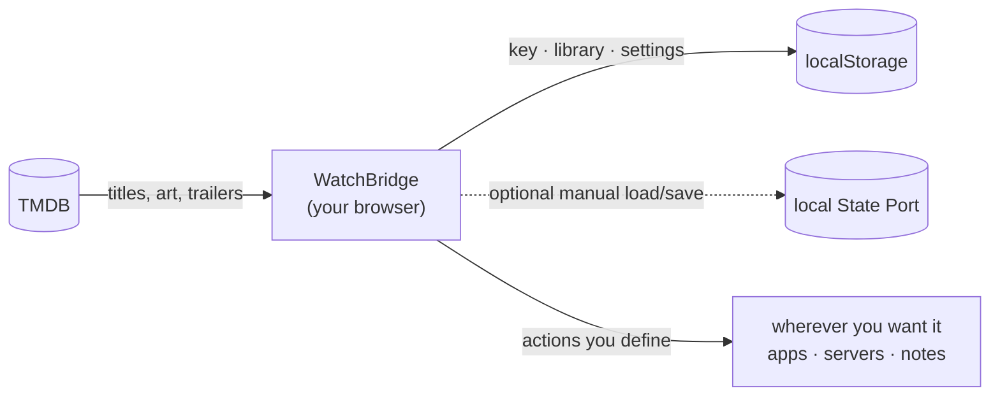

<div align="center">


# WatchBridge

**Decide what to watch - then actually do something about it.**

[**Open the app →**](https://tahsinature.github.io/watch-bridge/)

</div>

---

## What it is

Choosing something to watch usually means a dozen open tabs: one to look the
title up, one to read about it, one to see where it's streaming, one to find a
copy, one to note that you finished it. WatchBridge collapses that into a single
screen — and then lets you define, yourself, where a title goes next.

It's a static web app. By default there is no server, account, or database: it
runs entirely in your browser and keeps everything there. Local development can
optionally connect to the bundled State Port MVP for explicit cross-browser backup.

## How it works



**Search.** One box looks up films, series, actors, directors and producers.
When TMDB's regular text search has no strong match, WatchBridge lazily checks
a compact fuzzy index built from TMDB's official daily exports, so misspellings
and reversed words still surface likely matches.

**Triage.** Line up the candidates you're considering, put them side by side,
and pick one. When you've watched it, rate it and write down what you thought.

**Act.** This is the bridge. Every button attached to a title is one you
configure: give it a URL template, a clipboard string, an app link or an HTTP
request, and it gets filled in from whichever title is on screen. Send a film to
a tracker, push a download to a home server, open it in a native app, drop a
note into your log — whatever your setup happens to be. The app doesn't assume
one.

## Bring your own key

WatchBridge talks to [TMDB](https://www.themoviedb.org) for everything it
knows about a title, and you supply the key — free, takes a minute. It's stored
in your browser. If you explicitly save through local State Port, it is included
in the whole-document backup; State Port does not encrypt it.

That also means a link you share opens the _app_, not your data. There's nothing
to leak, and nothing to sign into.

## Running it locally

```bash
bun install
bun run dev
```

Then open **Settings** and paste your TMDB key.

```bash
bun run build      # typecheck + production build
bun run preview    # serve the build
```

The repository includes the generated fuzzy-search index. To refresh it from
TMDB's latest daily movie, TV and person exports:

```bash
bun run search-index:build
```

Pushing to `master` deploys to GitHub Pages via the included workflow, which
also refreshes the search index. A daily scheduled deployment keeps it current.
Set **Settings → Pages → Source** to **GitHub Actions** first.

Before merging a release, bump the patch version and commit the updated
`package.json`:

```bash
bun run version:patch
```

The current version is shown at the bottom of the app's Settings dialog.

## Testing local State Port integration

This is a local-development integration only. Start State Port first:

```bash
cd config-sync-service
docker compose up --build -d
```

Open [http://localhost:8080](http://localhost:8080), create or sign into an
account. In another terminal, start Watch Bridge:

```bash
bun install
bun run dev
```

Open [http://localhost:5173](http://localhost:5173), then use **Settings → State
Port Sync → Sign in with State Port**. Watch Bridge uses its built-in public
client identity, so ordinary users do not create an application or paste a
client UUID. Sign in and approve the requested read/write access in State Port.
On return, **Load Remote Configuration** explicitly replaces the local Watch
Bridge document, while **Save Local Configuration** writes the complete local
backup. There is no automatic background sync.

For a TV or console, choose **Use a TV or console code**. Watch Bridge displays
a short, one-time code and the State Port verification URL—there is no QR
image. Open that URL on a phone or computer, enter the code, review the
application name and requested access, then approve or deny it. The code expires
after ten minutes; Watch Bridge stops polling at expiry or when the pairing
panel is closed.

The built-in identity is public, not a secret. **Advanced / self-hosted client**
keeps a secondary client-ID override for administrators who intentionally use a
separate registered State Port application.

Watch Bridge stores the rotating State Port refresh credential in localStorage,
so a reload normally reconnects without another login. Disconnecting clears
this browser's credential; revoke the connection in the State Port dashboard to
invalidate it server-side. Access tokens remain short-lived and in memory.

If a save encounters a newer remote version, the local draft is preserved and
automatic saving remains stopped. The UI offers only **Use remote
configuration** or **Force overwrite with local**. Neither side is silently
discarded and no generic merge is attempted. Whole-document semantic no-ops do
not advance the remote version.

Defaults are `http://localhost:3000` for the State Port API and
`http://localhost:8080` for its dashboard. Copy `.env.example` to
`.env.local` only if you need to change them. Self-hosted operators can replace
the public built-in client ID consistently in Watch Bridge and State Port, and
must register exact Watch Bridge redirect URLs, including their trailing slash.

## Built with

[Bun](https://bun.sh) · [Vite](https://vite.dev) · React · TypeScript ·
[Tailwind](https://tailwindcss.com) · [shadcn/ui](https://ui.shadcn.com) ·
[Zustand](https://zustand.docs.pmnd.rs) · [TanStack Query](https://tanstack.com/query)

Data and images from TMDB; streaming availability from JustWatch. This product
uses the TMDB API but is not endorsed or certified by TMDB.

## License

[MIT](LICENSE) © Tahsin
