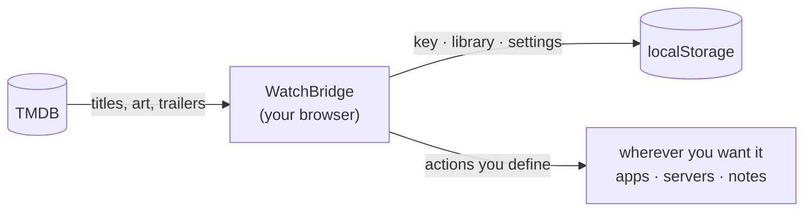

<div align="center">


# WatchBridge

**Decide what to watch - then actually do something about it.**

[**Open the app →**](https://tahsinature.github.io/watch-bridge/)

</div>

---

## What it is

Choosing something to watch usually means a dozen open tabs: one to look the
title up, one to read about it, one to see where it's streaming, one to find a
copy, one to note that you finished it. WatchBridge collapses that into a single
screen — and then lets you define, yourself, where a title goes next.

It's a static web app. No server, no account, no database. It runs entirely in
your browser and keeps everything there.

## How it works



**Search.** One box looks up films and series together, and ranks what comes
back so the things people have actually seen rise to the top rather than
whatever happens to match the text best.

**Triage.** Line up the candidates you're considering, put them side by side,
and pick one. When you've watched it, rate it and write down what you thought.

**Act.** This is the bridge. Every button attached to a title is one you
configure: give it a URL template, a clipboard string, an app link or an HTTP
request, and it gets filled in from whichever title is on screen. Send a film to
a tracker, push a download to a home server, open it in a native app, drop a
note into your log — whatever your setup happens to be. The app doesn't assume
one.

## Bring your own key

WatchBridge talks to [TMDB](https://www.themoviedb.org) for everything it
knows about a title, and you supply the key — free, takes a minute. It's stored
in your browser and sent nowhere else.

That also means a link you share opens the _app_, not your data. There's nothing
to leak, and nothing to sign into.

## Running it locally

```bash
bun install
bun run dev
```

Then open **Settings** and paste your TMDB key.

```bash
bun run build      # typecheck + production build
bun run preview    # serve the build
```

Pushing to `master` deploys to GitHub Pages via the included workflow. Set
**Settings → Pages → Source** to **GitHub Actions** first.

## Built with

[Bun](https://bun.sh) · [Vite](https://vite.dev) · React · TypeScript ·
[Tailwind](https://tailwindcss.com) · [shadcn/ui](https://ui.shadcn.com) ·
[Zustand](https://zustand.docs.pmnd.rs) · [TanStack Query](https://tanstack.com/query)

Data and images from TMDB; streaming availability from JustWatch. This product
uses the TMDB API but is not endorsed or certified by TMDB.

## License

[MIT](LICENSE) © Tahsin
